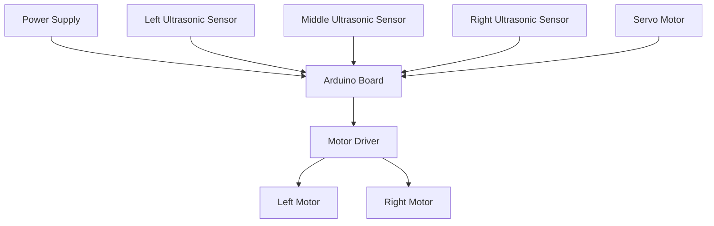
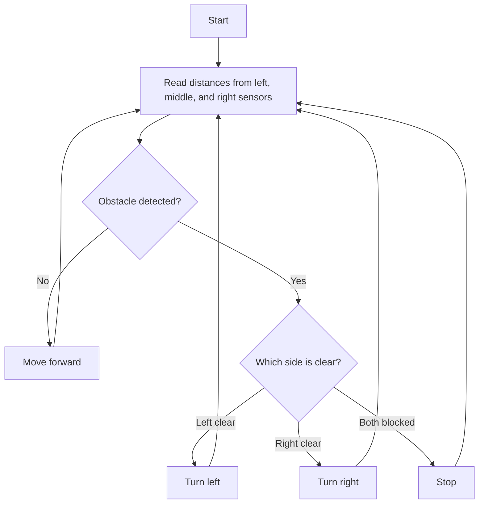

<p align="center">
  
</p>

# <p align="center">Obstacle avoidance robot using ultrasonic sensor</p>

<p align="center"><i>Smart Arduino robot that detects obstacles and navigates safely using ultrasonic sensors.</i></p>

<p align="center">
  
  
  
</p>

<p align="center">
  <a href="#-project-intro"></a>
  <a href="#-features"></a>
  <a href="#-how-to-setup-the-project"></a>
</p>

## Table of Contents

- [🚀 Project Intro](#-project-intro)
- [✨ Features](#-features)
- [🧰 Requirements](#-requirements)
- [⚙️ How to Setup the Project](#️-how-to-setup-the-project)
- [📁 Project Structure](#-project-structure)
- [🎥 Demonstration](#-demonstration)
- [📄 License](#-license)

## 🚀 Project Intro

This repository contains an Arduino-based obstacle avoidance robot that uses ultrasonic sensors to detect nearby objects and control motor movement. The robot continuously scans the front, left, and right sides, then decides whether to move forward, turn, or stop based on the measured distances.

The original project idea and hardware inspiration were adapted from the Instructables tutorial linked below:

- https://www.instructables.com/Obstacle-Avoidance-Robot-Using-Ultrasonic-Sensor-P/

## ✨ Features

### Core Features

| Feature | Status | Description |
| --- | --- | --- |
| Multi-direction obstacle detection | ✅ Current | Uses left, middle, and right ultrasonic sensors to measure distance around the robot. |
| Autonomous navigation | ✅ Current | Decides when to move forward, turn left, turn right, or stop based on sensor readings. |
| Motor control logic | ✅ Current | Drives the motors through Arduino pins to respond to detected obstacles. |
| Beginner-friendly Arduino project | ✅ Current | Provides a simple sketch for learning robotics, sensor interfacing, and embedded control. |

## 🧰 Requirements

### Hardware

- Arduino board (UNO or Mega recommended)
- HC-SR04 ultrasonic sensors (left, middle, right)
- Servo motor
- DC motors with motor driver circuit
- Power supply for the robot chassis
- Jumper wires and breadboard or PCB

### Software

- Arduino IDE
- Servo library
- NewPing library (if used in your setup)

## ⚙️ How to Setup the Project





### ⚙️ How It Works

1. The Arduino initializes the ultrasonic sensors and motor pins.
2. The robot measures distance values from the left, middle, and right sensors.
3. If the path is clear, the robot moves forward.
4. If an obstacle is detected, it turns in the safest available direction.
5. The process repeats continuously to keep the robot moving safely.

### Troubleshooting

- If the sensors do not respond, verify the trigger and echo wiring and check the power supply.
- If the motors do not move, confirm the motor driver connections and pin mapping in the code.
- If the serial output is missing, ensure the baud rate is set correctly in the Arduino IDE.

## 📁 Project Structure

```txt
OBSTACLE-AVOIDANCE-ROBOT-USING-ULTRASONIC-SENSOR/
├── HELPING MANNUAL/
│   ├── Library/
│   ├── Mannual/
│   └── Tutorial/
├── ORGINAL PROJECT/
│   ├── AUDUINO CODE/
│   │   └── obstacle_avoidance_robot.ino
│   ├── HEX CODE/
│   ├── LIBRARY/
│   └── Project Backups/
└── README.md
```

## 🎥 Demonstration

Watch the working project demonstration here:

https://youtu.be/ChVTrLkM7Q4

## 📄 License

This project is licensed under the MIT License. See the `LICENSE` file for details.
